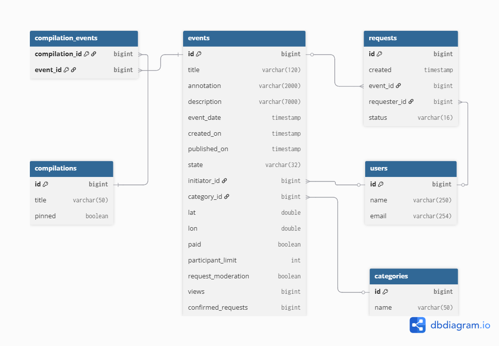
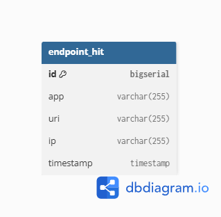

# Explore With Me

Микросервисное приложение для публикации и просмотра событий, с отдельным сервисом статистики.

📌 **Учебный дипломный проект** Яндекс Практикума (Java-разработчик, 2025).

---

## 🚀 Функционал
- Регистрация пользователей и управление профилями.
- Создание, публикация и модерация событий.
- Поиск и фильтрация событий (категории, даты, доступность, сортировка).
- Подборки событий (compilations).
- Заявки на участие в событиях (с подтверждением или без).
- Учёт просмотров событий через отдельный сервис статистики.

---

## 🛠️ Стек технологий
- **Java 17**
- **Spring Boot 3** (Spring Data JPA, Validation, Web, Lombok)
- **Hibernate / JPA**
- **PostgreSQL**
- **H2** (тестирование)
- **Flyway** (миграции БД)
- **Docker & Docker Compose**
- **Maven**
- **JUnit 5, Mockito**
- **Checkstyle / SpotBugs** (code quality)

---

## ⚙️ Архитектура
Проект состоит из двух сервисов:
1. **ewm-service** — основной сервис (пользователи, события, подборки, заявки).
2. **stats-service** — сервис для сбора и предоставления статистики по просмотрам.

Сервисы взаимодействуют по HTTP через клиент `StatsClient`.

---

## ▶️ Запуск проекта

### Вариант 1. Docker Compose (рекомендуется)
```bash
docker compose up --build
```
После запуска:

ewm-service доступен на http://localhost:8080

stats-service доступен на http://localhost:9090

### Вариант 2. Локально через Maven

Запустить PostgreSQL (параметры в application.properties).

Выполнить:
```bash
mvn clean install
mvn -pl ewm-service spring-boot:run
```

---

## 🧪 Тестирование
```bash
mvn test
```

Используются JUnit 5, Mockito, H2.

---

## 📚 API спецификации

- [ewm-main-service-spec.json](./ewm-main-service-spec.json) — основной сервис  
- [ewm-stats-service-spec.json](./ewm-stats-service-spec.json) — сервис статистики  

Можно открыть в [Swagger Editor](https://editor.swagger.io/).

---

## 🗂️ Основные эндпоинты
### Public API

GET /events — поиск событий

GET /events/{id} — просмотр события

GET /categories — список категорий

GET /compilations — подборки событий

### User API

POST /users/{id}/events — создать событие

PATCH /users/{id}/events/{eventId} — изменить событие

GET /users/{id}/requests — заявки на участие

### Admin API

GET /admin/events — поиск событий с фильтрацией

PATCH /admin/events/{eventId}/publish — публикация события

PATCH /admin/events/{eventId}/reject — отклонение события

### Stats API

POST /hit — сохранить информацию о запросе

GET /stats — получить статистику по URI и времени

---

## 📈 ER-диаграмма (структура данных)
### MainService

### StatsService

